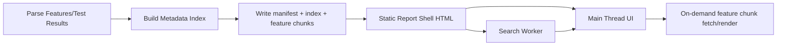

# BDD LivingDoc Performance Improvement Design

**Date:** March 5, 2026  
**Scope:** LivingDocGen Generator scalability for 3000+ large feature files

---

## 1) Current Architecture Overview

### 1.1 RazorEngine.NetCore Rendering Flow (Current + Effective State)

The documented architecture describes a Razor-based generation flow in `LivingDocGen.Generator`.

```text
Feature Files + Test Results
  -> Parser + TestReporter
  -> DocumentEnrichmentService
  -> HtmlGeneratorService / TemplateService
  -> Single self-contained HTML (inline CSS + JS + data)
```

Observed in current implementation:
- `HtmlGeneratorService` performs large `StringBuilder`-based HTML generation.
- `CssGenerator` and `JavaScriptGenerator` generate inline assets.
- Lazy placeholders are emitted for feature content and populated by JavaScript.
- `RazorEngine.NetCore` is still referenced in `LivingDocGen.Generator.csproj`, but core hot path is direct string generation.

### 1.2 Feature File Loading Mechanism

Current loading behavior:
- For smaller reports: all features render directly into initial HTML.
- For larger reports: placeholders are rendered with `data-lazy="true"`.
- A `feature-data` JSON script embeds generated feature HTML payloads.
- Feature content is rendered on demand using `renderFeatureContent(...)`.

Implication:
- Even in lazy mode, a large payload is still parsed/held in memory because the full feature HTML dataset is embedded in one document.

### 1.3 Search and Filtering Approach

Current behavior:
- Search is text-based against feature/scenario names.
- Filters: status (`passed|failed|skipped|untested`) and tags.
- Runtime logic iterates large DOM sets (`.feature`, `.scenario`) and updates `display` state.
- Lazy mode can force rendering of all lazy features before deep search/filter passes.

Implication at scale (3000+ features):
- High CPU from repeated DOM scans.
- Large memory due to full-page DOM + embedded JSON.
- Latency spikes under frequent search and filter usage.

---

## 2) Identified Performance Bottlenecks

### 2.1 Rendering

- Monolithic report payload inflates parse and initialization time.
- Search/filter operations depend heavily on full DOM traversal.
- Repetitive show/hide updates cause layout/reflow pressure.

### 2.2 Large Data Tables

- Horizontal scrolling is implemented, but very large row counts still create heavy DOM trees.
- Sticky headers + long tables increase paint/recalculate costs.

### 2.3 Scenario Outlines (Large Examples)

- Scenario outlines with many example rows produce large per-feature fragments.
- Rendering entire example tables upfront increases feature switch latency.

### 2.4 Search Scaling

- Search currently ties strongly to rendered DOM state.
- Combined status + tags + text filtering performs repeated broad scans.
- Lack of normalized inverted index increases per-query cost.

### 2.5 Memory Usage

- Embedded `feature-data` JSON with all feature HTML is memory-expensive.
- Multiple rendered features can remain in DOM without strict eviction policy.
- Duplicated strings in tags/search metadata increase heap pressure.

---

## 3) Proposed Scalable Architecture

## 3.1 High-Level Design

Adopt a **manifest + index + chunked feature payload** architecture while preserving current UX.



Core principles:
- Keep the initial shell lightweight.
- Load feature content only when needed.
- Move search/filter to metadata index + set intersection.
- Use worker thread for high-frequency query operations.

### 3.2 Manifest/Index Strategy

Output artifacts:
- `feature-manifest.json`: report-level metadata and chunk map.
- `feature-index.json`: normalized search/filter index.
- `features/<featureId>.json`: individual feature chunks.

Result:
- Initial load only parses shell + index metadata.
- Feature bodies are fetched and rendered on click/viewport demand.

### 3.3 Chunked Feature Loading

Recommended strategy:
1. Load shell + manifest + index.
2. Render sidebar from manifest metadata.
3. On feature selection, fetch chunk by `featureId`.
4. Cache chunk in memory LRU (default size 5-10 features).
5. Unmount non-active feature bodies to cap DOM size.

Optional prefetch:
- Prefetch adjacent sidebar features during idle time.

### 3.4 Lazy Loading and Virtualized Rendering

- **Feature-level lazy loading:** only active feature body mounted.
- **Scenario-level virtualization:** for features with >200 scenarios, render visible window.
- **Table row chunking:** for tables/examples with >200 rows, render first window and append rows in chunks.
- Preserve horizontal scrolling wrappers for table UX.

### 3.5 Search Indexing Model

Use normalized, precomputed metadata:
- Tokenized feature names and scenario names.
- Inverted index: `token -> scenarioIds`.
- Filter sets:
  - `status -> scenarioIds`
  - `tag -> scenarioIds`
  - `featureId -> scenarioIds`

Query model:
- Compute candidate sets independently.
- Intersect sets for combined criteria.
- Return result IDs and summary counts.
- UI updates only changed nodes (delta application).

### 3.6 Web Worker Usage

Use a dedicated search/filter worker for:
- Text token query evaluation.
- Status/tag set intersections.
- Optional fuzzy matching fallback.

Main thread responsibilities:
- DOM updates.
- Feature chunk fetch/render.
- Accessibility announcements and keyboard navigation.

### 3.7 Caching Strategy

**Build-time caching**
- Feature hash -> rendered chunk reuse.
- Index reuse for unchanged feature/test inputs.

**Runtime in-browser caching**
- In-memory LRU for feature chunks.
- Optional IndexedDB cache for repeat sessions.
- Versioned cache keys using report build fingerprint.

**HTTP/static hosting caching**
- Content-hashed chunk filenames.
- Long TTL immutable caching for versioned assets.

---

## 4) JSON Schema Definitions

> Note: These are implementation-ready contract schemas to guide generator + runtime integration.

### 4.1 `feature-manifest.json`

```json
{
  "$schema": "https://json-schema.org/draft/2020-12/schema",
  "$id": "https://livingdocgen.dev/schemas/feature-manifest.schema.json",
  "title": "Feature Manifest",
  "type": "object",
  "required": [
    "version",
    "buildId",
    "generatedAt",
    "totalFeatures",
    "totalScenarios",
    "indexFile",
    "featureMap"
  ],
  "properties": {
    "version": { "type": "string" },
    "buildId": { "type": "string" },
    "generatedAt": { "type": "string", "format": "date-time" },
    "totalFeatures": { "type": "integer", "minimum": 0 },
    "totalScenarios": { "type": "integer", "minimum": 0 },
    "indexFile": { "type": "string" },
    "featureMap": {
      "type": "array",
      "items": {
        "type": "object",
        "required": [
          "featureId",
          "name",
          "filePath",
          "status",
          "scenarioCount",
          "chunkFile"
        ],
        "properties": {
          "featureId": { "type": "string" },
          "name": { "type": "string" },
          "filePath": { "type": "string" },
          "status": {
            "type": "string",
            "enum": ["passed", "failed", "skipped", "untested"]
          },
          "scenarioCount": { "type": "integer", "minimum": 0 },
          "chunkFile": { "type": "string" },
          "tags": { "type": "array", "items": { "type": "string" } }
        },
        "additionalProperties": false
      }
    }
  },
  "additionalProperties": false
}
```

### 4.2 `feature-index.json`

```json
{
  "$schema": "https://json-schema.org/draft/2020-12/schema",
  "$id": "https://livingdocgen.dev/schemas/feature-index.schema.json",
  "title": "Feature Index",
  "type": "object",
  "required": [
    "version",
    "scenarioRecords",
    "invertedTokenIndex",
    "statusIndex",
    "tagIndex"
  ],
  "properties": {
    "version": { "type": "string" },
    "scenarioRecords": {
      "type": "array",
      "items": {
        "type": "object",
        "required": ["scenarioId", "featureId", "status", "tokens", "tags"],
        "properties": {
          "scenarioId": { "type": "string" },
          "featureId": { "type": "string" },
          "status": {
            "type": "string",
            "enum": ["passed", "failed", "skipped", "untested"]
          },
          "tokens": { "type": "array", "items": { "type": "string" } },
          "tags": { "type": "array", "items": { "type": "string" } }
        },
        "additionalProperties": false
      }
    },
    "invertedTokenIndex": {
      "type": "object",
      "additionalProperties": {
        "type": "array",
        "items": { "type": "string" }
      }
    },
    "statusIndex": {
      "type": "object",
      "required": ["passed", "failed", "skipped", "untested"],
      "properties": {
        "passed": { "type": "array", "items": { "type": "string" } },
        "failed": { "type": "array", "items": { "type": "string" } },
        "skipped": { "type": "array", "items": { "type": "string" } },
        "untested": { "type": "array", "items": { "type": "string" } }
      },
      "additionalProperties": false
    },
    "tagIndex": {
      "type": "object",
      "additionalProperties": {
        "type": "array",
        "items": { "type": "string" }
      }
    }
  },
  "additionalProperties": false
}
```

### 4.3 `feature-chunk.json`

```json
{
  "$schema": "https://json-schema.org/draft/2020-12/schema",
  "$id": "https://livingdocgen.dev/schemas/feature-chunk.schema.json",
  "title": "Feature Chunk",
  "type": "object",
  "required": ["featureId", "name", "status", "html", "scenarioSummary"],
  "properties": {
    "featureId": { "type": "string" },
    "name": { "type": "string" },
    "status": {
      "type": "string",
      "enum": ["passed", "failed", "skipped", "untested"]
    },
    "html": { "type": "string" },
    "scenarioSummary": {
      "type": "object",
      "required": ["total", "passed", "failed", "skipped", "untested"],
      "properties": {
        "total": { "type": "integer", "minimum": 0 },
        "passed": { "type": "integer", "minimum": 0 },
        "failed": { "type": "integer", "minimum": 0 },
        "skipped": { "type": "integer", "minimum": 0 },
        "untested": { "type": "integer", "minimum": 0 }
      },
      "additionalProperties": false
    },
    "contentStats": {
      "type": "object",
      "properties": {
        "maxTableRows": { "type": "integer", "minimum": 0 },
        "maxTableColumns": { "type": "integer", "minimum": 0 },
        "outlineExamples": { "type": "integer", "minimum": 0 }
      },
      "additionalProperties": false
    }
  },
  "additionalProperties": false
}
```

### 4.4 Worker Message Contract (`search-worker-contract.json`)

```json
{
  "$schema": "https://json-schema.org/draft/2020-12/schema",
  "$id": "https://livingdocgen.dev/schemas/search-worker-contract.schema.json",
  "title": "Search Worker Contract",
  "type": "object",
  "required": ["type", "requestId", "payload"],
  "properties": {
    "type": {
      "type": "string",
      "enum": ["INIT_INDEX", "QUERY", "RESULT", "ERROR"]
    },
    "requestId": { "type": "string" },
    "payload": {
      "type": "object",
      "properties": {
        "query": { "type": "string" },
        "status": {
          "type": "string",
          "enum": ["all", "passed", "failed", "skipped", "untested"]
        },
        "tags": { "type": "array", "items": { "type": "string" } },
        "scenarioIds": { "type": "array", "items": { "type": "string" } },
        "featureIds": { "type": "array", "items": { "type": "string" } },
        "count": { "type": "integer", "minimum": 0 },
        "message": { "type": "string" }
      },
      "additionalProperties": true
    }
  },
  "additionalProperties": false
}
```

---

## 5) Recommended Framework Direction

## 5.1 Option A — Continue with Current Generator + Optimizations (Recommended Near-Term)

**Recommendation:** Continue with current `LivingDocGen.Generator` runtime architecture and implement chunk/index/worker model.

Why this is preferred now:
- Lowest migration risk.
- Preserves current UX and output format compatibility.
- Delivers the largest immediate gains for 3000+ features.
- Avoids full framework rewrite before core data-access bottlenecks are fixed.

### 5.2 Option B — ASP.NET Core + API-backed Report Runtime

Use server APIs for chunk delivery, indexing, and filtering.

Pros:
- Centralized indexing and caching.
- Better for multi-user hosted scenarios and access control.

Cons:
- Adds backend operational overhead and deployment complexity.
- Loses some portability of fully static single-report artifacts.

### 5.3 Option C — Hybrid SPA Runtime (Svelte/React/Vue) + Generator API/Static Artifacts

Pros:
- Strong virtualization tooling and UI state handling.
- Excellent for highly interactive large-document navigation.

Cons:
- Highest migration complexity.
- Requires additional frontend build toolchain and governance.

**Strategic direction:**
1. Execute Option A first (core scalability fixes).  
2. Reassess Option B/C only if product needs move to multi-user hosted analytics workflows.

---

## 6) Migration Plan

### 6.1 Step-by-Step PR Breakdown

**PR-1: Contracts and Data Model Foundations** ✅
- ~~Add manifest/index/chunk model classes.~~ **COMPLETED**
- ~~Add schema docs and serializer tests.~~ **COMPLETED**
- ~~Keep legacy output path untouched.~~ **COMPLETED**

**PR-2: Generator Output Refactor (Dual Mode)** ✅
- ~~Add `--output-mode legacy|chunked` flag (default `legacy` initially).~~ **COMPLETED**
- ~~Emit `feature-manifest.json`, `feature-index.json`, and `features/*.json` for `chunked`.~~ **COMPLETED**
- ~~Add deterministic IDs for features/scenarios.~~ **COMPLETED**

**PR-3: Runtime Loader + Chunk Rendering** ✅
- ~~Load manifest/index at startup.~~ **COMPLETED**
- ~~Render sidebar from manifest metadata.~~ **COMPLETED**
- ~~Implement on-demand chunk fetch + LRU cache.~~ **COMPLETED**

**PR-4: Search Worker + Set-Intersection Filtering** ✅
- ~~Implement worker index initialization.~~ **COMPLETED**
- ~~Replace DOM-wide search/filter loops with worker result IDs.~~ **COMPLETED**
- ~~Add fallback to main-thread search for unsupported environments.~~ **COMPLETED**

**PR-5: Virtualization for Scenarios and Large Tables** ✅
- ~~Add scenario list windowing for large features.~~ **COMPLETED**
- ~~Add row chunk rendering for data tables/examples above threshold.~~ **COMPLETED**
- ~~Preserve horizontal scrolling behavior and sticky header UX.~~ **COMPLETED**

**PR-6: Default Switch + Hardening** ✅
- ~~Switch default output mode to `chunked` after benchmark gate passes.~~ **COMPLETED**
- ~~Keep `legacy` mode for backward compatibility window.~~ **COMPLETED** (deprecated with warning)

### 6.2 Risk Mitigation

- Feature flags for new runtime behavior.
- Contract tests for manifest/index/chunks.
- Golden snapshot tests for HTML parity.
- Performance regression checks in CI.
- Canary dataset with 3000+ features before default switch.

### 6.3 Backward Compatibility

- Maintain legacy mode for at least one major release cycle.
- Preserve existing CLI behavior unless explicitly opting into new mode.
- Keep current CSS classes/DOM semantics where feasible for custom automation.

---

## 7) Performance Benchmark Strategy

### 7.1 Metrics to Measure

**Generation-time metrics**
- Total generation duration.
- Index build duration.
- Chunk emission duration.
- Output size (shell, index, chunks).

**Runtime metrics**
- Time to first interactive (TTI).
- Time to first feature render.
- Feature switch latency (p50/p95).
- Search latency (p50/p95).
- Combined filter latency (status + tag + text).
- Peak memory and average memory under navigation workload.

**UX stability metrics**
- Main thread long tasks (>50ms).
- Scroll FPS in feature view with wide tables.

### 7.2 Expected Improvement Targets (3000+ Features)

Target thresholds after full rollout:
- **TTI:** <= 2.5s on benchmark baseline machine.
- **First feature render:** <= 400ms p95.
- **Search latency:** <= 120ms p95 for common queries.
- **Combined filter latency:** <= 150ms p95.
- **Memory reduction:** 40-60% lower peak memory vs monolithic embedded payload mode.
- **Feature switch latency:** <= 300ms p95 with warm chunk cache.

### 7.3 Benchmark Dataset Profiles

Use at least three controlled datasets:
- **Small:** 300 features, moderate tables.
- **Medium:** 1200 features, mixed scenario outlines.
- **Large:** 3000+ features with heavy data tables and examples.

---

## 8) Implementation Checklist (Ready-to-Execute)

- [x] Add manifest/index/chunk contracts and tests. ✅ (PR-1)
- [x] Implement chunked output mode in generator. ✅ (PR-2)
- [x] Implement shell loader and feature chunk fetch. ✅ (PR-3)
- [x] Implement worker-based search/filter engine. ✅ (PR-4)
- [x] Add scenario/table virtualization thresholds. ✅ (PR-5)
- [x] Add LRU + optional IndexedDB caching. ✅ (PR-3 — LRU implemented; IndexedDB deferred)
- [x] Add benchmark harness and CI regression gates. ✅ (PR-0 — harness implemented; CI gates deferred)
- [x] Flip default to chunked mode after passing performance SLOs. ✅ (PR-6)

---

## 9) Final Recommendation

For 3000+ large feature files with frequent search/filter use, the most practical and future-proof path is:

1. **Keep current generator codebase but move to chunked/indexed runtime architecture immediately.**  
2. **Use Web Worker-based search/filter with precomputed metadata indexes.**  
3. **Apply virtualization selectively (scenarios and very large tables/examples).**  
4. **Retain legacy mode temporarily for safe migration, then make chunked mode default.**

This approach minimizes migration risk while delivering the highest performance gains where current bottlenecks actually exist.

---

## 10) Deep Technical Review Addendum (Scalability Hardening)

This section captures a production-readiness review for **3000+ large feature files** under **heavy search and filtering usage**.

### 10.1 Executive Summary

- The proposed direction (manifest + index + chunked payload + worker search) is architecturally strong and should scale significantly better than monolithic embedded HTML.
- The design is **near production-ready**, but not yet fully implementation-ready without additional guarantees around concurrency, observability, error handling, and schema evolution.
- Primary risk is no longer raw rendering alone; it is **query-time data structure efficiency** and **runtime memory behavior** during sustained search/filter churn.

### 10.2 Critical Improvements Required (Must-Fix)

1. **Query Data Structure Upgrade (Mandatory)**
  - Replace string-heavy set intersections (`token -> string[]`) with compact structures:
    - sorted integer postings + galloping intersection, or
    - bitset/Roaring bitmap for status/tag/token candidate sets.
  - Rationale: reduces memory pressure and improves p95 query latency consistency.

2. **Worker Protocol Robustness**
  - Add cancellation and stale-result prevention:
    - `QUERY_CANCEL` message type.
    - Monotonic `querySeq` to discard out-of-order results.
  - Add deterministic request lifecycle states (`INIT`, `READY`, `ERROR`, `DEGRADED`).

3. **Compatibility + Integrity Validation**
  - Manifest/index/chunk files must include:
    - `schemaVersion`, `generatorVersion`, `buildId`.
    - Content hash/checksum for index and chunk files.
  - Runtime must hard-fail safely on incompatible major schema and soft-fallback on recoverable mismatch.

4. **Error Handling + Fallback Rendering Paths**
  - Define behavior for:
    - chunk fetch timeout/failure,
    - worker init failure,
    - index parse failure,
    - corrupted cache entries.
  - Required fallback: main-thread simplified filter path + user-visible degraded mode banner.

5. **Concurrency and Thread Safety**
  - Build-time chunk generation must use bounded parallelism and deterministic output ordering.
  - Runtime cache/eviction must be race-safe across rapid navigation and concurrent fetches.

6. **Observability Baseline (Required Before Default Switch)**
  - Instrument and emit:
    - query p50/p95/p99,
    - worker init time,
    - chunk fetch latency and cache hit ratio,
    - long tasks >50ms,
    - peak heap and DOM node count.
  - Include correlation identifiers (`buildId`, `sessionId`, `querySeq`) in diagnostics.

7. **Incremental Indexing/Chunking Plan**
  - Introduce file-hash dependency tracking for selective re-index/re-chunk in CI and local runs.
  - Avoid full rebuild requirement for small feature set changes.

8. **Security Hardening for HTML Chunks**
  - Define trust boundary for feature-derived HTML and sanitization policy.
  - Add CSP guidance for hosted deployments and strict escaping rules for untrusted data.

### 10.3 Recommended Enhancements (High Value)

- Use dynamic virtualization based on **DOM node budget + viewport**, not static thresholds only.
- Split chunk payload into metadata and render body to enable selective prefetch and payload trimming.
- Add optional compressed artifacts (`.json.br`) for hosted serving scenarios.
- Introduce precomputed feature-level prefilter index to reduce scenario-level intersections.
- Add query debounce and idle-time neighbor prefetch with backoff under memory pressure.
- Add optional warm-start from prior-session usage hints (most visited features/tags).

### 10.4 Schema-Level Improvements

#### 10.4.1 Versioning and Extensibility

Add the following top-level properties to all contracts:
- `schemaVersion` (contract version)
- `generatorVersion` (producer version)
- `compatibilityMinVersion` (minimum runtime contract version)
- `extensions` (forward-compatible non-breaking extension envelope)

#### 10.4.2 `feature-manifest.json` Additions

Recommended additional fields:
- `chunkStrategy` (e.g., `per-feature`, `hybrid`)
- `chunkCount`
- `indexHash`
- `capabilities` (worker search, virtualization support flags)
- Per-feature: `chunkHash`, `estimatedBytes`, `scenarioRange`

#### 10.4.3 `feature-index.json` Compactness Improvements

- Prefer numeric IDs (`scenarioOrdinal`, `featureOrdinal`) instead of repeated string IDs.
- Add dictionary encoding metadata:
  - `tokenDictionary`,
  - `normalization` (case folding, stemming, locale).
- Support optional compressed postings representation for large datasets.

#### 10.4.4 `feature-chunk.json` Robustness

Add:
- `chunkVersion`
- `chunkHash`
- `renderHints` (virtualization thresholds, table chunking policy)
- `dependencies` (if chunk references shared assets)

#### 10.4.5 Worker Contract Extensions

Add message types:
- `QUERY_CANCEL`
- `READY`
- `METRICS`

Add common fields:
- `protocolVersion`
- `querySeq`
- `timestamp`
- `stats` (evaluation duration, candidate counts)

Example request/response:

```json
{
  "type": "QUERY",
  "protocolVersion": "1.1",
  "requestId": "q-1042",
  "querySeq": 42,
  "payload": {
   "query": "refund api",
   "status": "failed",
   "tags": ["@critical"]
  }
}
```

```json
{
  "type": "RESULT",
  "protocolVersion": "1.1",
  "requestId": "q-1042",
  "querySeq": 42,
  "payload": {
   "scenarioIds": [12, 98, 441],
   "count": 3,
   "stats": {
    "evalMs": 18,
    "candidateCount": 57
   }
  }
}
```

### 10.5 Search and Filtering Scalability Guidance

1. **Tag Filtering Efficiency**
  - Implement tag -> bitset/postings index.
  - Optimize multi-tag AND using shortest-posting-first intersection.

2. **Status Filtering Performance**
  - Use precomputed status bitsets and avoid deriving status from DOM state.

3. **Full-Text Optimization**
  - Normalize tokens (lowercase + Unicode fold + delimiter normalization).
  - Support optional prefix index for interactive type-ahead.
  - Evaluate fuzzy search behind opt-in threshold to protect p95.

4. **Specialized Search Engine Decision Point**
  - For static/offline reports: worker + compact in-memory inverted index is sufficient.
  - For multi-user cross-report analytics: consider server-side search service (e.g., OpenSearch/Meilisearch/Azure AI Search).

### 10.6 Framework Direction Clarifications

- Continuing with current generator architecture remains the best near-term decision.
- `RazorEngine.NetCore` dependency is not the key scalability blocker; data access and runtime indexing strategy are.
- A full SPA rewrite should be deferred until objective evidence shows shell/runtime complexity exceeding maintainability thresholds.
- Document explicit trade-off:
  - **Static artifact mode:** maximum portability, lower ops overhead.
  - **Server-backed mode:** stronger global search/analytics and central governance, higher operational complexity.

### 10.7 Migration Plan Refinements (Risk Reduction)

Add intermediate steps to current PR plan:

- **PR-0 (New): Baseline + Instrumentation First** ✅
  - ~~Add telemetry hooks and benchmark harness before architecture changes.~~ **COMPLETED**
  - ~~Capture baseline metrics on 300/1200/3000+ datasets.~~ **COMPLETED**

- **PR-2.5 (New): Runtime Compatibility Layer** ✅
  - ~~Build contract loader with schema/version guards and fallback strategy before worker/search replacement.~~ **COMPLETED**
  - Added `ContractLoaderJavaScript.cs` with comprehensive runtime validation:
    - Schema version guards mirroring C# `ContractVersion.IsCompatible()` (major-must-match, minor-gte-minimum)
    - BuildId consistency guards detecting partial deploys / stale CDN artifacts
    - SHA-256 hash integrity validation via Web Crypto API for chunks and index
    - Structured fetch-with-retry with exponential backoff (configurable retries/delay)
    - Error classification enum (NETWORK_ERROR, VERSION_INCOMPATIBLE, HASH_MISMATCH, BUILD_MISMATCH, PARSE_ERROR, NOT_FOUND)
    - Runtime state machine (LOADING → READY | DEGRADED) with structured error log
    - Warning banner for non-fatal issues (version mismatch minor, hash mismatch, buildId mismatch)
    - Diagnostics API exposing runtime state, version info, and error history
  - Updated `ChunkedRuntimeJavaScript.cs` to delegate manifest/chunk loading to ContractLoader
  - Updated `SearchBridgeJavaScript.cs` to delegate index loading to ContractLoader with hash validation
  - Updated `HtmlGeneratorService.cs` script loading order: ContractLoader → ChunkedRuntime → SearchBridge
  - 68 unit tests in `ContractLoaderJavaScriptTests.cs` covering:
    - Version constant sync with C# `ContractVersion` (SchemaVersion, CompatibilityMinVersion, GeneratorVersion)
    - Schema compatibility logic (major match, minor gte, newer minor warning)
    - BuildId consistency detection
    - SHA-256 hash integrity (Web Crypto API, graceful degradation)
    - Fetch retry with exponential backoff and configurable parameters
    - Error classification constants and runtime state enum
    - Loading API surface (loadManifest, loadIndex, loadChunk)
    - Diagnostics API fields
    - Integration point verification (ChunkedRuntime + SearchBridge delegation)
    - Parse error handling for all artifact types

- **PR-4.5 (New): Query Correctness Gate** ✅
  - ~~Add deterministic golden tests for query correctness across combinations (status/tags/text).~~ **COMPLETED**
  - Added `QueryCorrectnessGoldenTests.cs` with 81 deterministic tests covering:
    - Canonical dataset (4 features, 12 scenarios) with known status/tag/text distributions
    - Status-only, tag-only, text-only queries
    - All pairwise combinations (status+tag, status+text, tag+text)
    - Triple combinations (status+tag+text)
    - Feature ordinal derivation from scenario ordinals
    - Determinism and reproducibility verification
    - Edge cases (empty inputs, single-char tokens, nonexistent values)
    - Exhaustive combinatorial coverage (all 4 statuses × 5 tag sets)

- **PR-5.5 (New): Memory Pressure + Eviction Tests**
  - Add stress tests for rapid navigation and query churn validating cache eviction and heap stability.

- **PR-7 (New): End-to-End Integration Tests** ✅
  - ~~Add full pipeline integration tests using real services (no mocks) validating all PR-0 through PR-6 changes.~~ **COMPLETED**
  - Added `ChunkedPipelineEndToEndTests.cs` with 39 integration tests covering:
    - Real service wiring: FeatureRenderer → ChunkEmitterService → IndexBuilderService → ManifestBuilderService → HtmlGeneratorService → ChunkedOutputPipeline
    - Canonical dataset (4 features, 12 scenarios) matching golden test distributions
    - File artifact validation (manifest, index, chunks, shell HTML)
    - Manifest correctness (feature map, scenario ranges, capabilities, schema version, hash integrity)
    - Index correctness (status distributions, inverted token index, tag index)
    - Chunk correctness (scenario summaries, HTML content, render hints)
    - Cross-artifact consistency (BuildId, feature IDs, chunk hashes, names)
    - Shell HTML validation (HTML structure, runtime JS, search bridge, worker)
    - Determinism (separate pipelines produce identical output)
    - Scale test (50 features × 10 scenarios, 500 total)
    - Edge cases (empty docs, single scenario, cancellation, custom options)

### 10.8 PR Gate Criteria and Acceptance Checks

Default switch to `chunked` mode is blocked until all gates pass:

1. **Correctness Gates**
  - Query result parity vs legacy mode on canonical datasets.
  - No data loss for scenario outlines/tables under virtualization.

2. **Performance Gates (3000+ dataset)**
  - `TTI <= 2.5s` (baseline machine definition required).
  - Search p95 <= 120ms; combined filter p95 <= 150ms.
  - Feature switch p95 <= 300ms with warm cache.

3. **Memory Gates**
  - Peak memory reduction >= 40% vs legacy monolithic mode.
  - No unbounded DOM growth during 30-minute synthetic navigation workload.

4. **Resilience Gates**
  - Graceful degraded behavior verified for worker/index/chunk failures.
  - Cache corruption detection and auto-recovery validated.

5. **Compatibility Gates**
  - Legacy mode remains functional for one major release cycle.
  - Schema backward compatibility policy documented and tested.

### 10.9 Missing Considerations Checklist (Now Explicit)

- [ ] Concurrency handling policy documented (build-time and runtime).
- [ ] Thread-safety strategy documented for caches and worker communication.
- [ ] Incremental indexing strategy documented and benchmarked.
- [ ] Observability metrics and dashboards defined.
- [ ] Logging strategy defined (structured fields + sampling policy).
- [ ] Error handling and fallback rendering flows tested.
- [ ] Load testing strategy defined for long-session churn and burst queries.
- [ ] Extensibility policy defined for schema and runtime feature flags.

### 10.10 Final Readiness Recommendation

The design is **directionally correct and strong**, but should be treated as **implementation-ready with conditions** rather than immediately production-ready.

Proceed with implementation after completing Must-Fix items in this addendum and enforcing the PR gates in Section 10.8.
